.. _examples:

1. Introduction to Examples
==============================

This section demonstrates the core functionality of the ``pySlope`` package with examples.

You can follow along with examples online: |binder|

.. |binder| image:: https://mybinder.org/badge_logo.svg
   :target: https://mybinder.org/v2/gh/JesseBonanno/pyslope/main?filepath=pySlope%2Fexamples%2Freadme_example.ipynb

2. Basic Usage (Readme example)
============================================================

2.1 Overview
+++++++++++++++++++

Let's walk through a typical use case to investigate the slope shown in the figure below.

.. figure:: ../../pyslope/examples/readme_example_plot_boundary.png
  :width: 700
  :alt: slope_boundary_plot

A typical use case of the `pySlope` package involves the following steps:

1. Create a `Slope` object
2. Create `Material` objects and assign to `Slope`
3. Create `Udl` or `PointLoad` objects and assign to `Slope`
4. Set water table
5. Set analysis limits
6. Analyse slope for critical factor of safety
7. Create plots

2.2 Creating a Slope
++++++++++++++++++++++++

Concept
---------

The creation of a `Slope` instance involves the input of the:

   - slope height (m) and
   - angle (deg) or
   - length (m)

Only one of the values is used out of the length and angle, the other value should be set to None.

Code
---------

.. code-block:: python

       s = Slope(height=3, angle=30, length=None)

Plot
---------

Plot generated using `plot_boundary()` function.

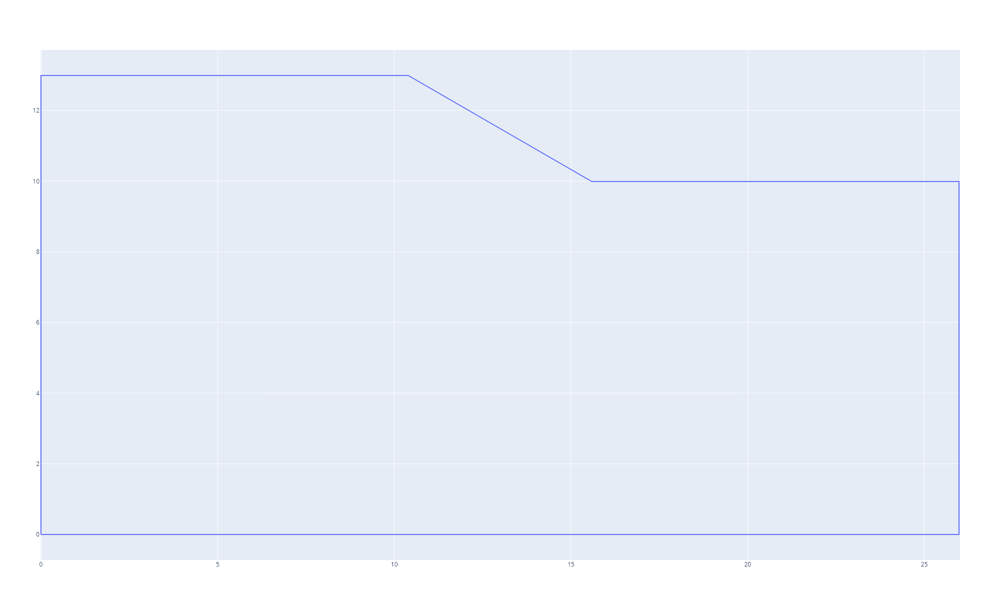

2.3 Defining Materials
++++++++++++++++++++++++

Concept
---------

The creation of a `Material` object involves the input of:

   - unit weight (kN/m3)
   - friction angle
   - cohesion (kPa)
   - depth from top of slope to bottom of material layer (m)

Once an instance of a `Material` is created it can then be assigned to the `Slope` instance.

Code
---------

.. code-block:: python

       # Material defined with key word arguments
       m1 = Material(
           unit_weight=20,
           friction_angle=45,
           cohesion=2,
           depth_to_bottom=2
       )

       # Material defined with positional arguments
       m2 = Material(20, 30, 2, 5)

       # An unlimited number of materials can be assigned at one time
       s.set_materials(m1, m2)        

Plot
---------

Plot generated using `plot_boundary()` function.

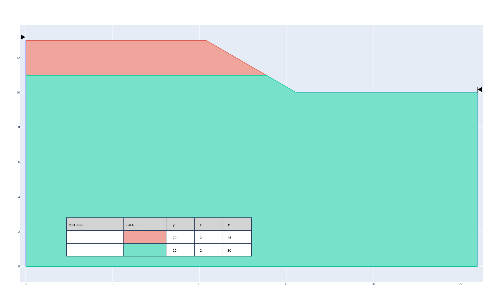

2.4 Defining Uniform Loads
++++++++++++++++++++++++++++++

Concept
---------

The creation of a `Udl` (uniform distributed load) object involves the input of:

   - magnitude of load (kPa)
   - offset of load from crest of slope (m) (default 0 m)
   - length of load (m) (default infinite)

Code
---------

.. code-block:: python

       u1 = Udl(magnitude = 100, offset = 2, length = 1)

       # by default offset = 0 (m) and length = None.
       u2 = Udl(magnitude = 20)    

       # assign uniform loads to model 
       s.set_udls(u1, u2)

Plot
---------

Plot generated using `plot_boundary()` function.

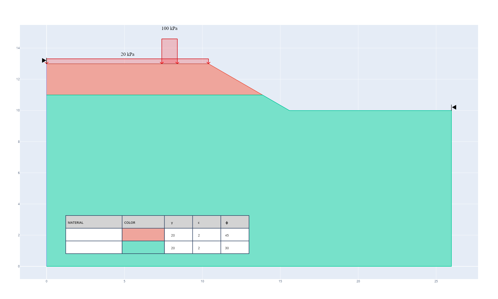

2.5 Defining Line Loads
++++++++++++++++++++++++++

Concept
---------

The creation of a `LineLoad` object involves the input of:

   - magnitude of load (kN / m)
   - offset of load from crest of slope (m) (default 0 m)

Code
---------

.. code-block:: python

       # define line load, similiar to Udl except there is no length parameter and magnitude is in units (kN/m)
       p1 = LineLoad(magnitude = 10, offset = 3)
       
       # assign line loads to slope
       s.set_lls(p1)

Plot
---------

Plot generated using `plot_boundary()` function.

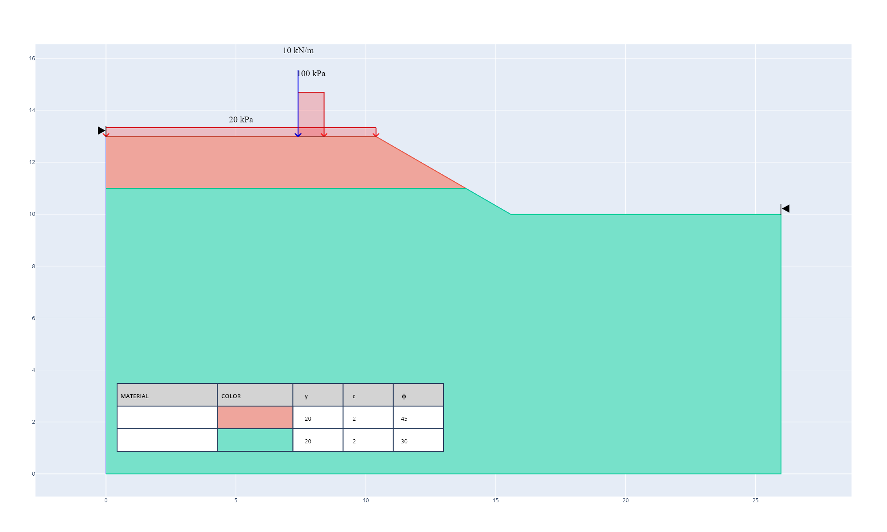

2.6 Defining Water Table
++++++++++++++++++++++++++++

Concept
---------

By default there is no water table. The water table is defined by its depth from the top of the slope (m).

Code
---------

.. code-block:: python

       s.set_water_table(4)

Plot
---------

Plot generated using `plot_boundary()` function.

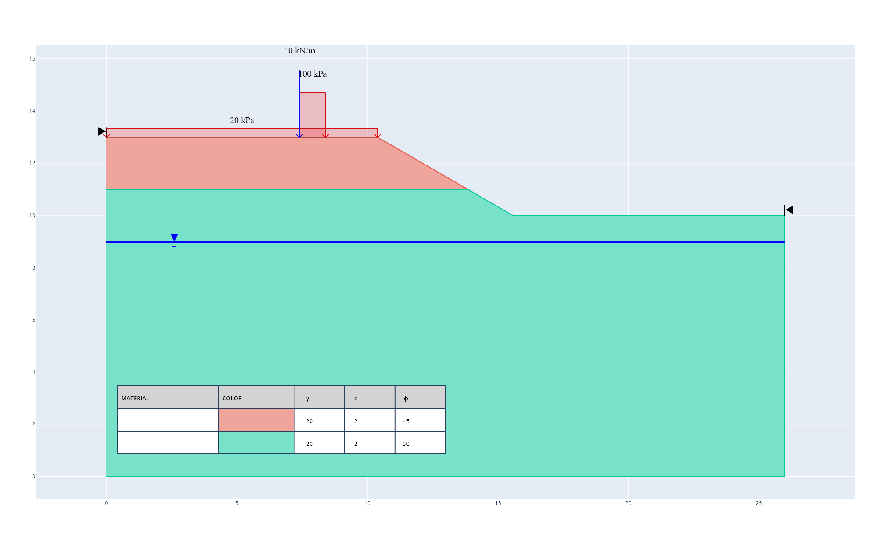

2.7 Defining Analysis Limits
+++++++++++++++++++++++++++++++++

Concept
----------

Analysis limits can be specified as a general left and right limit, OR as a set of limits which control the range from which the top of failures can occur and the bottom of failures can occur.

Currently the model coordinates are dynamic in that the overall model dimensions are based on the size of the slope.

The `get_top_coordinates` and `get_bottom_coordinates` methods can be useful to help define limits in reference to the top and bottom of the slope.

Code
----------

.. code-block:: python

       s.set_analysis_limits(s.get_top_coordinates()[0] - 5, s.get_bottom_coordinates()[0] + 5)

Plot
-------

Plot generated using `plot_boundary()` function.

2.8 Analysing the slope
++++++++++++++++++++++++++++

Concept
------------

To analyse the `Slope` the `analyse_slope()` method is called. By default 2000 iterations are run with 50 slices per failure plane.

Code
------------------

.. code-block:: python
   
       # The user can change the number of slices and iterations with the method below.
       # The line below is implicitly called and only required by the user if they want to change iterations
       s.update_analysis_options(
           slices=50,
           iterations=2500,
           tolerance=0.005,
           max_iterations=50
       )
       
       # run analysis
       s.analyse_slope()

       # print out minimum calculated factor of safety
       print(s.get_min_FOS())

2.9 Interpretting Results
++++++++++++++++++++++++++++

Concept
------------

After analysing the slope a plot of results can help to visualise the failure mechanism of the slope.
There are three different types of plots that can be called:

   - plot_boundary() - plots only the boundary and may be called without analysis)
   - plot_critical() - plots the boundary with the critical failure of the slope, only should be called after analysing slope
   - plot_all_planes(max_fos=i) - plots the boundary with all slope failures below fos i (where i is number)

Code 
------

.. code-block:: python
       
       s.plot_boundary()
       s.plot_critical()
       s.plot_all_planes(max_fos=2)

Plots
--------

Plots generated from code above in their respective orders.

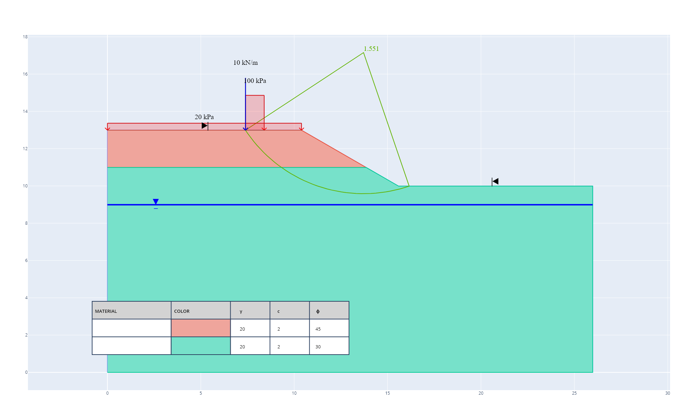

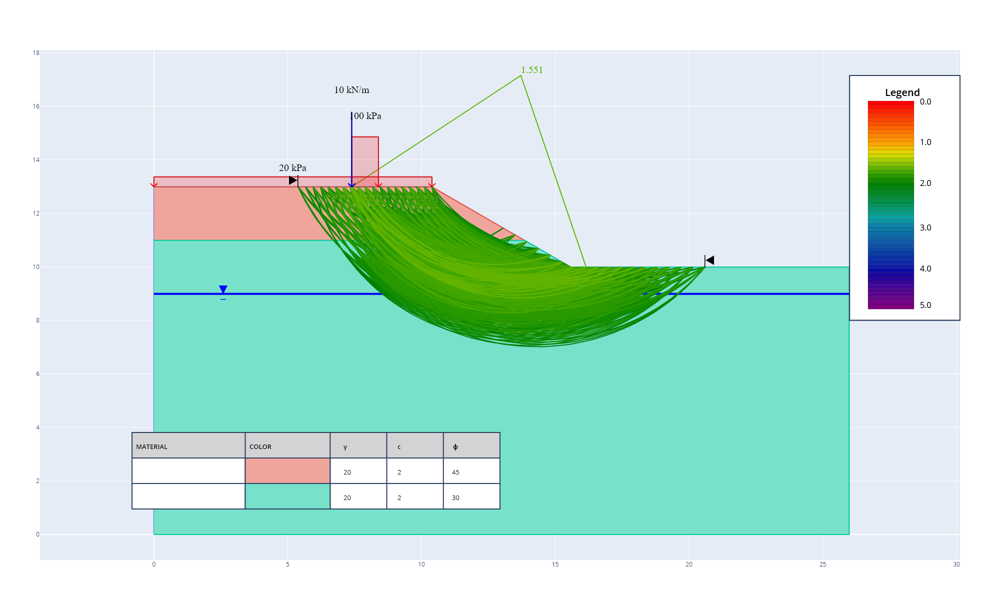

2.10 Dynamic Analysis
++++++++++++++++++++++++++++

Concept
------------

Instead of standard "static" analysis the user also has the option to make load objects "dynamic". The user can then perform a dynamic analysis rather than static, which moves the load in order to determine the required offset for a minimum factor of safety.

Considering the example above, we can continue and make u1 dynamic.

Code
-------

.. code-block:: python

       # remove udl object load from slope
       s.remove_udls(u1)

       # now lets add the udl again but this time set the load as 'dynamic'
       # for all loads and materials we also have the option to set the color ourselves
       # lets try set the color as 'purple'
       s.set_udls(
           Udl(magnitude=100, length=1, offset=2, dynamic_offset=True, color='purple')
       )

       # run dynamic analysis aiming for a FOS of 1.4
       s.analyse_dynamic(critical_fos=1.4)

       # get dictionary of all determined minimum FOS with key value pairing of offset : value
       s.get_dynamic_results()

       # or can print the values out
       s.print_dynamic_results()

From this we get the following output results:

   - Offset: 0.000 m, FOS: 1.288
   - Offset: 0.735 m, FOS: 1.402
   - Offset: 1.463 m, FOS: 1.510
   - Offset: 5.186 m, FOS: 1.684

We can also get a plot as after running dynamic analysis all plots are based on the final iteration of the dynamic analysis.

Plot
--------

Plot generated using `plot_all_planes()` function with keyword argument `max_fos=2`.

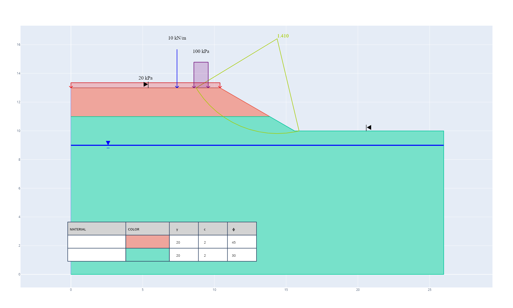

3. Validation of Results
==============================

3.1 Validation Tools
++++++++++++++++++++++++

To simplify validating results the results of ``pySlope`` will be compared to other similiar software for a range of cases.
The software to be considered is:

   - RocScience Slide v6.0
   - Hyrcan Version 1.75

Rocscience is a commercial software for 2D Limit Equilibrium Analysis for Slopes widely used in the industry. 

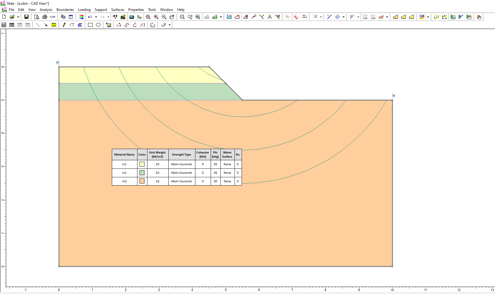

HYRCAN is a free Slope Stability analysis program for Geo-Engineers and can be found at this link: http://www.geowizard.org/download_hyrcan.html

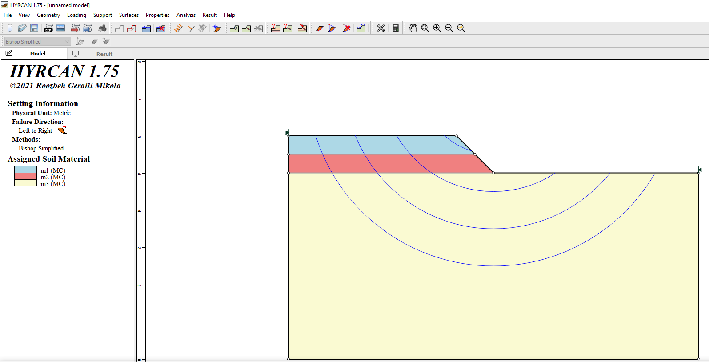

To be consistent the following settings were normalised across all programs:

   - slices = 50
   - tolerance = 0.005
   - max_iterations = 15

3.2 Validation Models
+++++++++++++++++++++++++

Description
-------------

The following models were seperately assessed to validate ``pySlope``:

   a. Typical model with no cohesion
   b. Case a. + material 2 updated to have cohesion
   c. Case b. + water table added in at 0.7 m below ground level
   d. Case c. + 20 kPa load offset at 0.5 m with a 2 m length added to slope
   e. Case c. + 5 kN/m LineLoad added at offset of 1 m.

For each model specific circular failures where assessed. They were all centred 2.5 m above the toe of the slope with radii from 2 m up to 6 m.

Code
----------

You can view the models created with ``pySlope`` online: |binder_validation|

.. |binder_validation| image:: https://mybinder.org/badge_logo.svg
   :target: https://mybinder.org/v2/gh/JesseBonanno/pyslope/main?filepath=pySlope%2Fexamples%2Fvalidation.ipynb

Results
-------------

.. pyexcel-table:: ../../pyslope/examples/summary_results.xlsx

3.3 Effect of Number of slices on results
+++++++++++++++++++++++++++++++++++++++++++++++++++++++++++

Description
--------------

For case a. pySlope and Slide results were compared for a different range of slices.
Both show results are reasonably close to the result with a large number of slices, however Slide does appear to do better with lower numbers of slices
(it is possible using a more precise method to calculate strip weight rather than an approximation as pySlope does).

Code
---------

.. code-block:: python

       # Effect of slices on results
       s = Slope(height=1, angle=None, length=1)
 
       m1 = Material(20, 35, 0, 0.5)
       m2 = Material(20, 35, 0, 1)
       m3 = Material(18, 30, 0, 5)
 
       s.set_materials(m1, m2, m3)
 
       for r in range(2, 6):
           s.add_single_circular_plane(
               c_x=s.get_bottom_coordinates()[0],
               c_y=s.get_bottom_coordinates()[1] + 2.5,
               radius=r,
           )

       slices = [10, 25, 50, 500, 2000]
 
       for i in slices:
           
           s.update_analysis_options(slices=i)
           s.analyse_slope()
 
           print(f'Slices: {i}')
           for a in s._search:
               print(f'radius: {a["radius"]}, FOS: {a["FOS"]}')

Results
-------------

.. pyexcel-table:: ../../pyslope/examples/slices.xlsx

3.4 Effectiveness of Slope Search Method
+++++++++++++++++++++++++++++++++++++++++++++++++++++++++++

Description
----------------

code
---------

.. code-block:: python

       s = Slope(height=1, angle=None, length=1.5)

       m1 = Material(20, 40, 1, 0.3)
       m2 = Material(20, 35, 2, 1)
       m3 = Material(18, 30, 0, 1.5)
       m4 = Material(16, 28, 0, 5)

       s.set_materials(m1, m2, m3, m4)

       ll1 = LineLoad(
           magnitude = 5,
           offset = 0.5,
       )

       ll2 = LineLoad(
           magnitude=20,
           offset = 2.5,
       )

       s.set_lls(ll1, ll2)

       udl1 = Udl(
           magnitude=100,
           offset = 1,
           length =0.5,
       )

       udl2 = Udl(
           magnitude=300,
           length=0.5,
           offset = 3,
       )

       s.set_udls(udl1,udl2)

       iterations = [1000, 2000, 5000]

       for i in iterations:
           s.update_analysis_options(slices=50, iterations = i)
           s.analyse_slope()

           # plot the critical failure surface
           fig_1 = s.plot_all_planes(max_fos=1.4)
           # fig_1.write_image(f'./search/pySlope_{i}.png')

Results
------------

.. pyexcel-table:: ../../pyslope/examples/search.xlsx

*Note that for pySlope the factor of safety increases with the search in this case.
This is not typical and probability wise the reverse is more common.

Plots
------------

pySlope 1000 iterations with factor of safety <= 1.4 below.

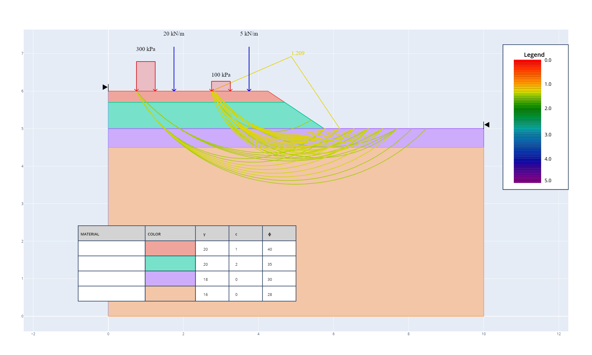

pySlope 5000 iterations with factor of safety <= 1.4 below.

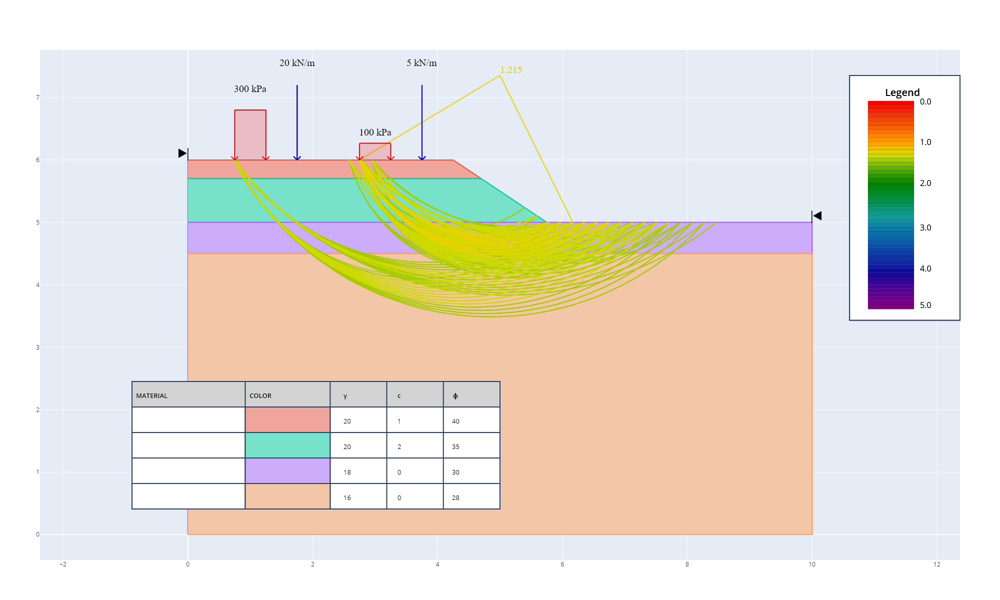

Slide 1000 iterations with factor of safety <= 1.4 below.

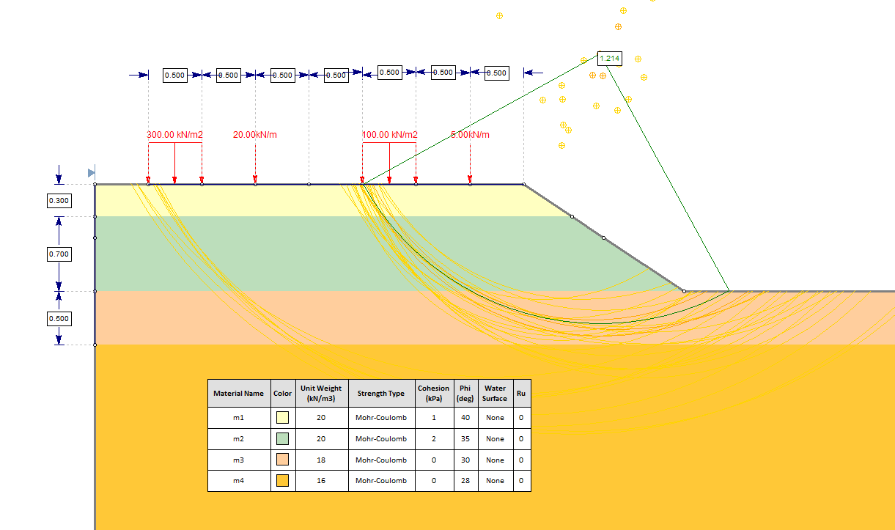

Slide 5000 iterations with factor of safety <= 1.4 below.

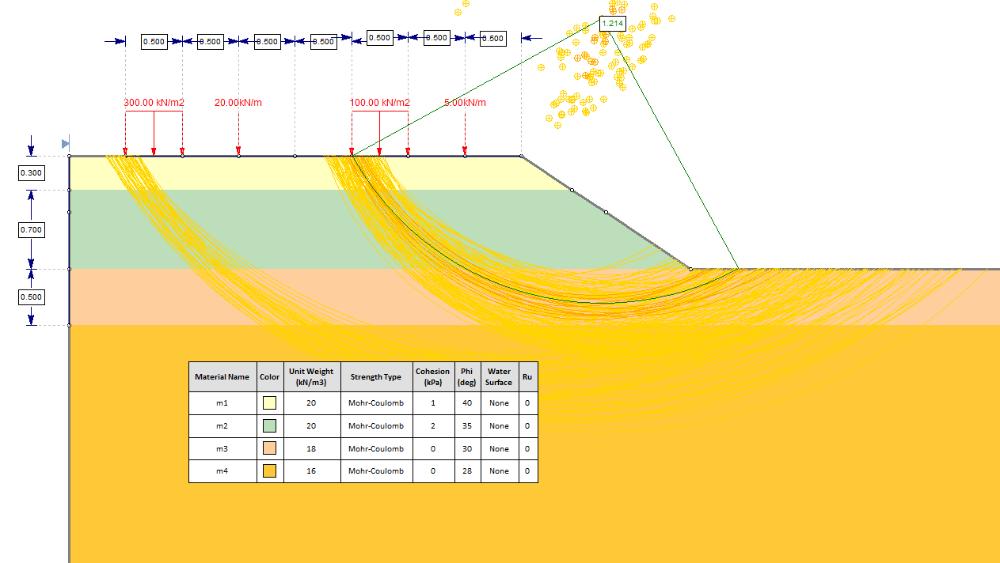

